<div align="center">



[](https://git.io/typing-svg)

<br/>

<a href="mailto:thakurisiddhanth1@gmail.com"></a>
<a href="https://linkedin.com/in/siddhanththakuri"></a>
<a href="https://leetcode.com/u/siddhanththakuri/"></a>
<a href="https://github.com/SIDDHANTH-THAKURI"></a>
<a href="https://siddhanththakuri.com"></a>

<br/><br/>


</div>


## 🧠 About Me

```yaml
name:       Siddhanth Thakuri
location:   Sydney, Australia 🇦🇺
education:  MSc Computer Science — Machine Learning & Big Data (UOW, 2025)
experience: Software Developer @ Accenture (2021–2023)
currently:  Building ShiftMate & WAYA | QIBA Professional Year (IT)
visa:       Subclass 485 — Full work rights until Aug 2028
open_to:    Developer, ML Engineer, Full-Stack roles in Australia
```


## 🚀 Currently Building

<div align="center">

<table>
<tr>
<td width="50%" valign="top">

<table width="100%">
<tr><td colspan="2" style="border-left: 3px solid #6E56CF; padding-left: 8px;">

**📅 ShiftMate** &nbsp; 

</td></tr>
<tr><td>Stack</td><td><code>React · Node.js · PostgreSQL · Stripe</code></td></tr>
<tr><td>Type</td><td>AI Workforce Scheduling SaaS</td></tr>
<tr><td>Stage</td><td>🔨 MVP → Beta</td></tr>
<tr><td>Link</td><td><a href="https://shift-mate-gamma.vercel.app/">shift-mate-gamma.vercel.app ↗</a></td></tr>
</table>

</td>
<td width="50%" valign="top">

<table width="100%">
<tr><td colspan="2" style="border-left: 3px solid #38bdf8; padding-left: 8px;">

**🗓️ WAYA** &nbsp; 

</td></tr>
<tr><td>Stack</td><td><code>React · AI/NLP · Socket.io</code></td></tr>
<tr><td>Type</td><td>AI Group Scheduling — When Are You Available?</td></tr>
<tr><td>Impact</td><td>47 min → ~2 min scheduling time</td></tr>
<tr><td>Link</td><td><a href="https://waya-pi.vercel.app/">waya-pi.vercel.app ↗</a></td></tr>
</table>

</td>
</tr>
<tr>
<td width="50%" valign="top">

<table width="100%">
<tr><td colspan="2" style="border-left: 3px solid #a78bfa; padding-left: 8px;">

**🧬 DrugNexusAI** &nbsp; 

</td></tr>
<tr><td>Stack</td><td><code>FastAPI · Node.js · AWS · MongoDB</code></td></tr>
<tr><td>Type</td><td>Clinical Decision Support System</td></tr>
<tr><td>AI</td><td>ChemBERTa DDI · 9+ LLM fallbacks</td></tr>
<tr><td>Link</td><td><a href="https://drugnexusai.app">drugnexusai.app ↗</a></td></tr>
</table>

</td>
<td width="50%" valign="top">

<table width="100%">
<tr><td colspan="2" style="border-left: 3px solid #6E56CF; padding-left: 8px;">

**💡 More Projects** &nbsp; 

</td></tr>
<tr><td>AlgoViz</td><td><a href="https://algo-viz-pi.vercel.app/">algo-viz-pi.vercel.app ↗</a></td></tr>
<tr><td>Portfolio</td><td><a href="https://siddhanththakuri.com/">siddhanththakuri.com ↗</a></td></tr>
<tr><td>Focus App</td><td><a href="https://demon-slayer-focus.vercel.app/">demon-slayer-focus ↗</a></td></tr>
<tr><td>All Repos</td><td><a href="https://github.com/SIDDHANTH-THAKURI">github.com/SIDDHANTH-THAKURI ↗</a></td></tr>
</table>

</td>
</tr>
</table>

</div>


## 🛠️ Tech Stack

<div align="center">

[](https://skillicons.dev)

[](https://skillicons.dev)

</div>


## 💼 Professional Experience

### 💻 Software Developer — Accenture *(2021–2023)*

| | |
|---|---|
| 🔷 | Delivered enterprise-scale apps using **C#, ASP.NET Core, React.js** on Azure |
| 🔷 | Optimised MS SQL Server — reduced query times and improved responsiveness |
| 🔷 | Designed and integrated REST APIs to automate data exchange across systems |
| 🔷 | 120+ code reviews in Agile/SCRUM teams — reduced defects by **18%** |
| 🔷 | Supported Azure deployments, streamlining releases and minimising downtime |
| 🏆 | **Unsung Hero Award (2022)** — recognised for outstanding contribution |


## 📊 GitHub Stats

<div align="center">

<table>
<tr>
<td>

</td>
<td>

</td>
</tr>
</table>


<br/>


</div>


## 📈 Coding Activity

<!--START_SECTION:waka-->


**🐱 My GitHub Data** 

> 📦 ? Used in GitHub's Storage 
 > 
> 🏆 19 Contributions in the Year 2026
 > 
> 💼 Opted to Hire
 > 
> 📜 12 Public Repositories 
 > 
> 🔑 0 Private Repositories 
 > 
**I'm a Night 🦉** 

```text
🌞 Morning                22 commits          █░░░░░░░░░░░░░░░░░░░░░░░░   04.91 % 
🌆 Daytime                158 commits         █████████░░░░░░░░░░░░░░░░   35.27 % 
🌃 Evening                169 commits         █████████░░░░░░░░░░░░░░░░   37.72 % 
🌙 Night                  99 commits          ██████░░░░░░░░░░░░░░░░░░░   22.10 % 
```
📅 **I'm Most Productive on Friday** 

```text
Monday                   26 commits          █░░░░░░░░░░░░░░░░░░░░░░░░   05.80 % 
Tuesday                  48 commits          ███░░░░░░░░░░░░░░░░░░░░░░   10.71 % 
Wednesday                28 commits          ██░░░░░░░░░░░░░░░░░░░░░░░   06.25 % 
Thursday                 48 commits          ███░░░░░░░░░░░░░░░░░░░░░░   10.71 % 
Friday                   135 commits         ████████░░░░░░░░░░░░░░░░░   30.13 % 
Saturday                 130 commits         ███████░░░░░░░░░░░░░░░░░░   29.02 % 
Sunday                   33 commits          ██░░░░░░░░░░░░░░░░░░░░░░░   07.37 % 
```


📊 **This Week I Spent My Time On** 

```text
🕑︎ Time Zone: Australia/Sydney

💬 Programming Languages: 
No Activity Tracked This Week

🔥 Editors: 
No Activity Tracked This Week

🐱‍💻 Projects: 
No Activity Tracked This Week

💻 Operating System: 
No Activity Tracked This Week
```

**I Mostly Code in TypeScript** 

```text
TypeScript               6 repos             ███████████░░░░░░░░░░░░░░   42.86 % 
JavaScript               3 repos             █████░░░░░░░░░░░░░░░░░░░░   21.43 % 
Python                   2 repos             ████░░░░░░░░░░░░░░░░░░░░░   14.29 % 
HTML                     1 repo              ██░░░░░░░░░░░░░░░░░░░░░░░   07.14 % 
CSS                      1 repo              ██░░░░░░░░░░░░░░░░░░░░░░░   07.14 % 
```


**Timeline**


 Last Updated on 07/04/2026 01:06:46 UTC
<!--END_SECTION:waka-->


## 🐍 Contribution Snake

<div align="center">

<picture>
  <source media="(prefers-color-scheme: dark)" srcset="https://raw.githubusercontent.com/SIDDHANTH-THAKURI/SIDDHANTH-THAKURI/output/github-snake-dark.svg"/>
  <source media="(prefers-color-scheme: light)" srcset="https://raw.githubusercontent.com/SIDDHANTH-THAKURI/SIDDHANTH-THAKURI/output/github-snake.svg"/>
  
</picture>

</div>


## 🌐 3D Contribution Graph

<div align="center">

[](https://github.com/SIDDHANTH-THAKURI)

</div>


## 📚 LeetCode

<div align="center">

</div>


## 🎓 Education & Certifications

| | | |
|---|---|---|
| 🎓 | **QIBA Professional Year Program (IT)** | Jan 2026 – Present |
| | Government-accredited 44-week ICT program — Australian workplace training + industry internship | |
| 🎓 | **MSc Computer Science** *(Machine Learning and Big Data)* — University of Wollongong | 2023 – 2025 |
| 🎓 | **BEng Aeronautical Engineering** — MLR Institute of Technology, India | 2017 – 2021 |
| 📜 | **Microsoft Certified: Security, Compliance and Identity Fundamentals (SC-900)** | |
| 📜 | **Python Crash Course** — Google / Coursera | |


## 🏅 Achievements

- 🥇 **Accenture Unsung Hero Award (2022)** — recognised for outstanding team contribution
- 📜 **Microsoft Certified: SC-900** — Security, Compliance and Identity Fundamentals
- 🎯 **CodinGame Spring Challenge 2025** — Global competitive programming participant
- 📜 **Python Crash Course** — Google / Coursera


## ⚡ Fun Facts

🚀 Built my first deep learning model on a potato laptop 🥔💻
✈️ Aviation enthusiast — Bachelor's in Aeronautical Engineering before pivoting to software
🤖 Can explain Transformers (the ML ones… and the robots if you insist)


<div align="center">

*"Turning ideas into code, and code into impact."*


</div>
