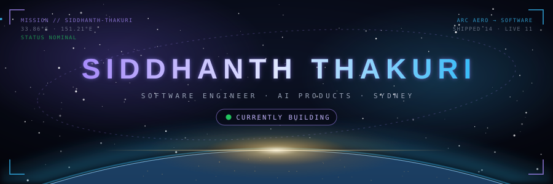

<div align="center">



[](https://git.io/typing-svg)

<br/>

<a href="https://siddhanththakuri.com"></a>
<a href="https://linkedin.com/in/siddhanththakuri"></a>
<a href="mailto:thakurisiddhanth1@gmail.com"></a>
<a href="https://leetcode.com/u/siddhanththakuri/"></a>

<br/><br/>


</div>


## 🧠 About Me

```yaml
name:        Siddhanth Thakuri
role:        Software Engineer @ DBM — Discount Building Material
location:    Sydney, Australia 🇦🇺
arc:         Aeronautical Engineering → Enterprise .NET → AI products
previously:  Software Engineer @ Accenture (2021–2023)
education:   MSc Computer Science, ML & Big Data — UOW (Distinction)
shipped:     14 projects · 11 live
building:    B2B portals, integrations & AI-assisted automation
```

> I build things from problems I've actually lived — and every project below started as something I needed to exist.


## 🚀 Selected Work

<div align="center">

<table>
<tr>
<td width="50%" valign="top">

**🎸 [Air Studio](https://www.playairstudio.com/)** &nbsp; 

Instruments you play with your hands and a webcam — no controller, no install.

<sub>MediaPipe hand tracking → One-Euro filtering → Karplus-Strong string synthesis in a custom AudioWorklet. All client-side at 60 fps; the video never leaves the tab.</sub>

<code>JavaScript</code> <code>MediaPipe</code> <code>Web Audio</code> <code>Tone.js</code> <code>WebGL</code>

</td>
<td width="50%" valign="top">

**🧬 [DrugNexusAI](https://drugnexusai.app)** &nbsp; 

A production clinical decision support system for drug-interaction analysis. Real users, not a demo.

<sub>Four-service architecture, a ChemBERTa-based interaction predictor, HIPAA-aware de-identification, and a context-aware chatbot with a 9+ model LLM fallback chain.</sub>

<code>React</code> <code>FastAPI</code> <code>Node.js</code> <code>MongoDB</code> <code>AWS</code>

</td>
</tr>
<tr>
<td width="50%" valign="top">

**🎯 [SOLSTRIKE](https://solstrike-eight.vercel.app)** &nbsp; 

A fast arena FPS in the browser — and the whole game is ~160 KB gzipped.

<sub>No asset files: every model, map and sound is generated at runtime. Custom AABB collide-and-slide movement, A* bots, and an optional head-pose aiming mode.</sub>

<code>Three.js</code> <code>Vite</code> <code>WebAudio</code> <code>MediaPipe</code>

</td>
<td width="50%" valign="top">

**📖 [LORESCAPE](https://github.com/SIDDHANTH-THAKURI/LORESCAPE)** &nbsp; 

Upload a book, then walk around inside it.

<sub>Segments a text into ~50 scenes, generates explorable low-poly worlds, and gives characters streaming dialogue with memory in ChromaDB. Every ML layer degrades gracefully.</sub>

<code>React</code> <code>Three.js</code> <code>FastAPI</code> <code>Claude API</code> <code>ChromaDB</code>

</td>
</tr>
<tr>
<td width="50%" valign="top">

**🎙️ [InterviewIQ](https://interview-iq-smoky.vercel.app)** &nbsp; 

A mock interview with an AI that listens, looks, and adapts.

<sub>Streaming speech in both directions with sentence-level TTS so there's no dead air, amplitude-driven lip sync, periodic webcam analysis, and a scored report at the end.</sub>

<code>Next.js</code> <code>Claude API</code> <code>Deepgram</code> <code>ElevenLabs</code> <code>WebSockets</code>

</td>
<td width="50%" valign="top">

**☕ [BrewDeck](https://github.com/SIDDHANTH-THAKURI/BrewDeck)** &nbsp; 

Drive Claude Code from your phone — or from an actual phone call.

<sub>A PIN-gated PWA streaming build output to your handset while the work runs on your PC. Call it, and Twilio + Deepgram + ElevenLabs route you in, with hooks blocking anything destructive.</sub>

<code>Node.js</code> <code>WebSocket</code> <code>Twilio</code> <code>Deepgram</code> <code>PWA</code>

</td>
</tr>
</table>

</div>

<details>
<summary><b>📦 Also shipped — 8 more</b></summary>

<br/>

| Project | What it is | Link |
|---|---|---|
| **Aether** | Gesture-driven WebGL experiments — throw fireballs with your hands | [live ↗](https://aether-gamma-eight.vercel.app) |
| **WAYA** | AI group scheduling with real-time chat, polls and a mobile app | [live ↗](https://waya.onrender.com/) |
| **ShiftMate** | AI rostering with sick-day cover calls, dashboards and credit billing | [live ↗](https://shiftmate-1.onrender.com/) |
| **Job Hunter** | Scores job listings against a real profile and writes the tailored resume | [repo ↗](https://github.com/SIDDHANTH-THAKURI/Job-Hunter) |
| **HireReady** | Paste a job description, get a tailored resume in 30 seconds | [live ↗](http://hirereadyai.app/) |
| **AlgoViz** | Sorting and pathfinding algorithms, visualised step by step | [live ↗](https://algo-viz-pi.vercel.app) |
| **Demon Slayer Focus** | A Pomodoro timer set inside the world of Demon Slayer | [live ↗](https://demon-slayer-focus.vercel.app) |
| **Escape Velocity** | A door-choice game inspired by Takeshi's Castle — PC & Android | [itch.io ↗](https://team-aero.itch.io/escape-velocity) |

</details>


## ✈️ The Hangar

I trained as an aeronautical engineer before I wrote software for a living, so my portfolio has a hidden page where the old maths gets to play:

- **Wind tunnel** — real potential flow around a Joukowski aerofoil. Lift comes from circulation, not a lookup table. Pitch it until it stalls.
- **Ascent to orbit** — a two-stage launch integrating the rocket equation, drag and gravity. Throttle through max-Q or the airframe lets go; the verdict is the real conic from your final state vector.
- **Paper glide** — thread fourteen rings, one per shipped project.

<div align="center">

<a href="https://siddhanththakuri.com/hangar"></a>

</div>


## 🛠️ Tech Stack

<div align="center">

[](https://skillicons.dev)

[](https://skillicons.dev)

<sub><b>AI & realtime:</b> Claude API · Claude Code · RAG · ChromaDB · MediaPipe · Web Audio · Deepgram · ElevenLabs</sub><br/>
<sub><b>Integrations:</b> Stripe · Twilio · Resend · Xero · CometChat · Zapier</sub>

</div>


## 💼 Experience

### 🏗️ Software Engineer — DBM, Discount Building Material *(Jun 2026 – Present)*

| | |
|---|---|
| 🔷 | Build and maintain production **B2B portals** and internal business systems, end to end |
| 🔷 | Full-stack delivery on **React, TypeScript, Node.js and Supabase** |
| 🔷 | Integrate **Stripe, Twilio, Resend, Xero and Cloudinary** into core business workflows |
| 🔷 | Replace manual operational processes with **AI-assisted automation** |

### 💻 Software Engineer — Accenture *(2021 – 2023)*

| | |
|---|---|
| 🔷 | Delivered enterprise applications in **C#, ASP.NET Core and SQL Server** on Azure |
| 🔷 | **120+ code reviews**, contributing to an **18% reduction** in defect rates |
| 🔷 | Supported frontend work in React and ASP.NET MVC beyond the backend role |
| 🏆 | **Unsung Hero Award (2022)** — hired one level above standard graduate entry |


## 📊 GitHub Stats

<div align="center">

<table>
<tr>
<td>

</td>
<td>

</td>
</tr>
</table>


<br/>


</div>


## 📈 Coding Activity

<!--START_SECTION:waka-->


**🐱 My GitHub Data** 

> 📦 ? Used in GitHub's Storage 
 > 
> 🏆 145 Contributions in the Year 2026
 > 
> 💼 Opted to Hire
 > 
> 📜 21 Public Repositories 
 > 
> 🔑 0 Private Repositories 
 > 
**I'm a Night 🦉** 

```text
🌞 Morning                41 commits          ███░░░░░░░░░░░░░░░░░░░░░░   10.25 % 
🌆 Daytime                103 commits         ██████░░░░░░░░░░░░░░░░░░░   25.75 % 
🌃 Evening                175 commits         ███████████░░░░░░░░░░░░░░   43.75 % 
🌙 Night                  81 commits          █████░░░░░░░░░░░░░░░░░░░░   20.25 % 
```
📅 **I'm Most Productive on Thursday** 

```text
Monday                   40 commits          ██░░░░░░░░░░░░░░░░░░░░░░░   10.00 % 
Tuesday                  66 commits          ████░░░░░░░░░░░░░░░░░░░░░   16.50 % 
Wednesday                40 commits          ██░░░░░░░░░░░░░░░░░░░░░░░   10.00 % 
Thursday                 94 commits          ██████░░░░░░░░░░░░░░░░░░░   23.50 % 
Friday                   57 commits          ████░░░░░░░░░░░░░░░░░░░░░   14.25 % 
Saturday                 79 commits          █████░░░░░░░░░░░░░░░░░░░░   19.75 % 
Sunday                   24 commits          ██░░░░░░░░░░░░░░░░░░░░░░░   06.00 % 
```


📊 **This Week I Spent My Time On** 

```text
🕑︎ Time Zone: Australia/Sydney

💬 Programming Languages: 
JavaScript               2 hrs 43 mins       ██████████░░░░░░░░░░░░░░░   39.07 % 
TypeScript               1 hr 20 mins        █████░░░░░░░░░░░░░░░░░░░░   19.07 % 
Other                    56 mins             ███░░░░░░░░░░░░░░░░░░░░░░   13.35 % 
Bash                     47 mins             ███░░░░░░░░░░░░░░░░░░░░░░   11.23 % 
Markdown                 40 mins             ██░░░░░░░░░░░░░░░░░░░░░░░   09.55 % 

🔥 Editors: 
Claude Code              6 hrs 3 mins        ██████████████████████░░░   86.60 % 
VS Code                  56 mins             ███░░░░░░░░░░░░░░░░░░░░░░   13.40 % 

🐱‍💻 Projects: 
brewdeck                 3 hrs 34 mins       █████████████░░░░░░░░░░░░   51.06 % 
groupstats               1 hr 57 mins        ███████░░░░░░░░░░░░░░░░░░   28.09 % 
harsha's project         1 hr 1 min          ████░░░░░░░░░░░░░░░░░░░░░   14.66 % 
brewdeck-call-scratch    25 mins             ██░░░░░░░░░░░░░░░░░░░░░░░   06.19 % 

💻 Operating System: 
Windows                  6 hrs 59 mins       █████████████████████████   100.00 % 
```

**I Mostly Code in TypeScript** 

```text
TypeScript               12 repos            ███████████░░░░░░░░░░░░░░   44.44 % 
JavaScript               8 repos             ███████░░░░░░░░░░░░░░░░░░   29.63 % 
HTML                     3 repos             ███░░░░░░░░░░░░░░░░░░░░░░   11.11 % 
Python                   3 repos             ███░░░░░░░░░░░░░░░░░░░░░░   11.11 % 
CSS                      1 repo              █░░░░░░░░░░░░░░░░░░░░░░░░   03.70 % 
```


**Timeline**


 Last Updated on 23/09/2026 01:53:13 UTC
<!--END_SECTION:waka-->


## 🐍 Contribution Snake

<div align="center">

<picture>
  <source media="(prefers-color-scheme: dark)" srcset="https://raw.githubusercontent.com/SIDDHANTH-THAKURI/SIDDHANTH-THAKURI/output/github-snake-dark.svg"/>
  <source media="(prefers-color-scheme: light)" srcset="https://raw.githubusercontent.com/SIDDHANTH-THAKURI/SIDDHANTH-THAKURI/output/github-snake.svg"/>
  
</picture>

</div>


## 🌐 3D Contribution Graph

<div align="center">

[](https://github.com/SIDDHANTH-THAKURI)

</div>


## 📚 LeetCode

<div align="center">

</div>


## 🎓 Education & Certifications

| | | |
|---|---|---|
| 🎓 | **MSc Computer Science** *(Machine Learning & Big Data)* — University of Wollongong · Distinction, WAM 77.9 | 2023 – 2025 |
| 🎓 | **BEng Aeronautical Engineering** — MLR Institute of Technology, India · published UAV design research | 2017 – 2021 |
| 🎓 | **ACS Professional Year Program (ICT)** — QIBA, Sydney | Jan – Sep 2026 |
| 📜 | **Microsoft Certified: Security, Compliance & Identity Fundamentals (SC-900)** | |
| 📜 | **Python Programming & Computational Thinking** — NPTEL, IIT Ropar | 2020 |
| 📜 | **Python Crash Course** — Google / Coursera | |
| 🪪 | **Australian Computer Society** — Associate Member | |


## 🏅 Achievements

- 🥇 **Accenture Unsung Hero Award (2022)** — recognised for outstanding contribution to delivery
- 🎓 **Academic Excellence Scholarship** — University of Wollongong
- 🎯 **CodinGame Spring Challenge 2025** — global competitive programming participant
- 🧩 **280+ LeetCode problems** solved


## ⚡ Fun Facts

✈️ Studied aircraft before software — and built a working wind tunnel into my portfolio to prove the degree wasn't wasted<br/>
🚀 Built my first deep learning model on a potato laptop 🥔💻<br/>
🎸 Wrote a Karplus-Strong string synthesiser so I could play guitar without owning one<br/>
🤖 Can explain Transformers (the ML ones… and the robots if you insist)


<div align="center">

*"I build things from problems I've actually lived."*


</div>
